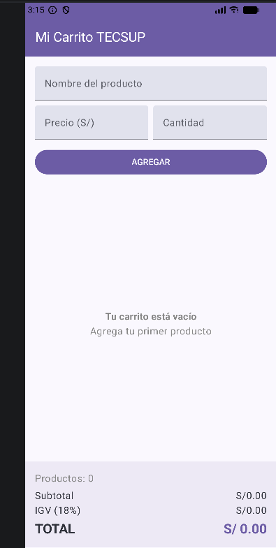

Lab 04 – Carrito de Compras

Desarrollador: Brayan Olano

Sobre el proyecto

Este proyecto consiste en una app móvil construida con Jetpack Compose que simula el funcionamiento de un carrito de compras. El usuario puede ingresar el nombre, el precio y la cantidad de un artículo, y este se añade instantáneamente a una lista visible en pantalla. Cada artículo puede eliminarse por separado tocando el ícono correspondiente, y en la parte inferior siempre se mantiene visible un resumen con la cantidad de productos, el subtotal, el IGV calculado al 18% y el monto final a pagar. Todo el recálculo de precios ocurre en tiempo real, sin necesidad de botones adicionales, gracias al manejo de estado reactivo que ofrece Compose.

Preguntas del laboratorio
1. ¿Cuál es la ventaja de usar mutableStateListOf frente a una lista mutable común?

La diferencia está en que Compose necesita "enterarse" cuando los datos cambian para volver a dibujar la pantalla. mutableStateListOf cumple ese rol: es una lista conectada al sistema de estados de Compose, de modo que cualquier inserción o eliminación dispara automáticamente una recomposición de la interfaz. Si en su lugar se usara una lista mutable tradicional de Kotlin, esta podría modificarse sin problema, pero la pantalla se quedaría "congelada" mostrando datos desactualizados, porque Compose nunca sabría que algo cambió.

2. Si la lista se declara con val, ¿cómo es posible seguir agregando o quitando elementos?

val restringe la reasignación de la variable, es decir, impide que en algún momento se le asigne una lista completamente nueva. Sin embargo, no restringe lo que ocurre dentro del objeto que esa variable referencia. Como mutableStateListOf devuelve una colección mutable por naturaleza, sus funciones internas (como agregar o eliminar elementos) siguen disponibles sin ningún conflicto, ya que no se está tocando la referencia, solo el contenido.

3. Dentro de la LazyColumn, ¿para qué sirve aplicar weight(1f)?

Ese modificador reparte el espacio disponible dentro de una columna entre sus elementos hijos según proporciones. Al asignarle weight(1f) únicamente a la LazyColumn, se logra que esta absorba todo el espacio vertical que sobra después de reservar lo necesario para el formulario de arriba y el panel de totales de abajo. Esto genera que la lista de productos se pueda desplazar libremente (scroll), mientras que el resumen de compra permanece fijo y siempre visible en la parte baja de la pantalla.

Vista sin productos registrados

Vista con productos ya cargados

